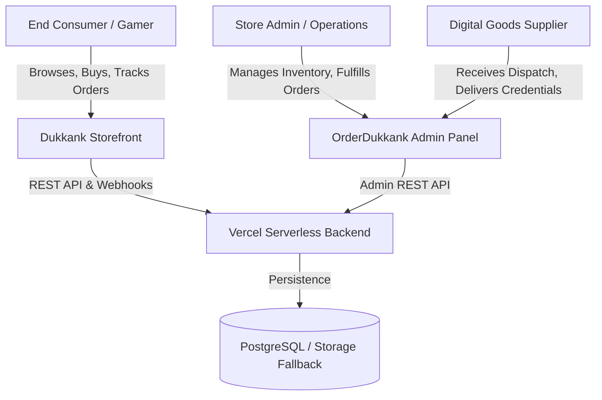
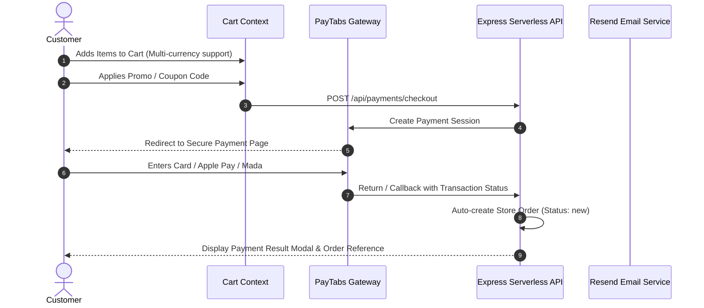
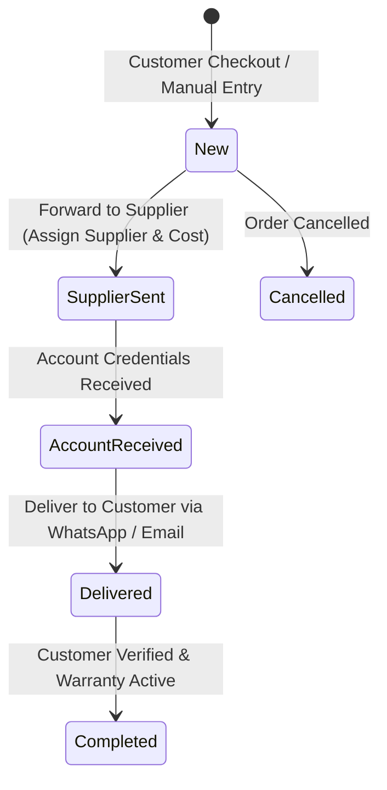
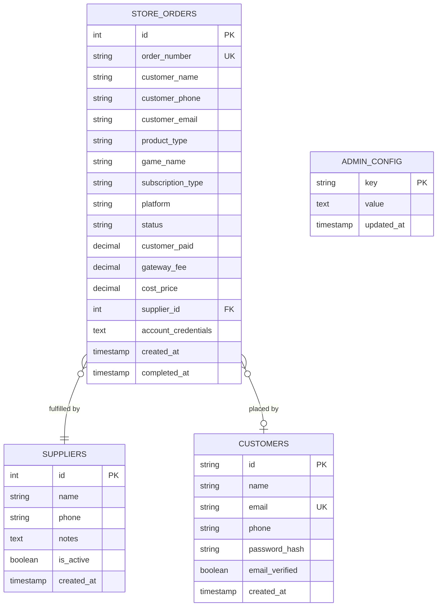
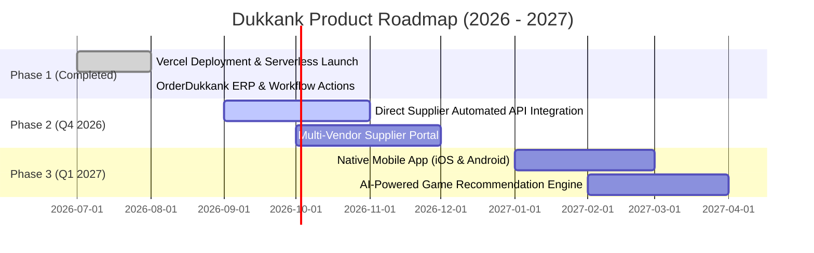

# Product Requirement Document (PRD)
## Project: Dukkank (دُكانك) — Next-Generation Gaming & Digital Services Platform

---

### Document Information
- **Project Name:** Dukkank Store (`دُكانك`)
- **Version:** 1.0.0 (Production Release)
- **Status:** Active & Deployed
- **Production URL:** [https://dukkank-store.vercel.app](https://dukkank-store.vercel.app)
- **Primary Domain:** `dukkank.store`
- **Target Audience:** MENA Region Digital Gamers (GCC, Jordan, Saudi Arabia, UAE, Kuwait)
- **Document Author:** Lead System Architect & Product Engineering Team
- **Last Updated:** August 2026

---

## 1. Executive Summary & Vision

### 1.1 Product Vision
**Dukkank** is a modern, high-performance eCommerce ecosystem engineered specifically for digital gaming products, PlayStation Plus subscription accounts, in-game virtual currencies (such as EA Sports FC Coins), and upcoming AAA title reservations (e.g., Grand Theft Auto VI).

The platform bridges the gap between digital video game suppliers and end-consumers in the Arab world by offering instant digital delivery, ultra-fast localized payment checkout (via PayTabs supporting Mada, Apple Pay, Visa/Mastercard, and STC Pay), and automated order fulfillment pipelines with automated WhatsApp notifications and Resend email verification.

### 1.2 Core Value Propositions
1. **Instant Fulfillment Pipeline:** Integrated supplier dispatch workflow for game accounts and digital license keys.
2. **Frictionless Mobile-First Experience:** 100% responsive Arabic RTL-native user interface built with Tailwind CSS and Framer Motion.
3. **Enterprise-Grade Admin ERP (OrderDukkank):** Full lifecycle order management with financial margins, cost tracking, supplier routing, and audit logs.
4. **Dual Data Resilience:** Hybrid architecture operating seamlessly on high-performance PostgreSQL or automated in-memory and local storage failover.
5. **Bank-Grade Security:** Rate limiting DoS shield, OTP-based customer registration via Resend API, JWT admin authentication, and automated session invalidation.

---

## 2. User Personas & Target Demographics



### 2.1 Persona 1: "Tariq" — The Console & PC Gamer
- **Demographics:** Age 18–34, lives in Riyadh/Dubai/Amman, active PlayStation 5 / PC user.
- **Goals:** Purchase PlayStation Plus Deluxe 12-month subscriptions at discounted rates with zero friction and instant activation details.
- **Pain Points:** Complex registration flows, untrusted payment gateways, delayed delivery times from manual sellers on social media.

### 2.2 Persona 2: "Omar" — The Store Owner & Operations Lead
- **Role:** Administrator and business operator managing daily cash flow, supplier relationships, and customer inquiries.
- **Goals:** Centralized dashboard tracking gross revenue, cost price, net margins, supplier fulfillment statuses, and automated WhatsApp delivery copy.
- **Pain Points:** Losing track of customer WhatsApp messages, manual inventory spreadsheets, lack of customer purchase history analytics.

### 2.3 Persona 3: "Digital Game Supplier"
- **Role:** Wholesale vendor providing primary/secondary PlayStation account credentials and CD keys.
- **Interaction:** Receives structured procurement orders from Dukkank admins, delivers credentials, and tracks fulfilled batch orders.

---

## 3. Technology Stack & Architectural Overview

```mermaid
flowchart LR
    subgraph Client Layer
        React["React 19 + Vite"]
        Tailwind["Tailwind CSS v4"]
        Lucide["Lucide Icons + Sonner"]
    end

    subgraph Serverless Edge Layer
        Vercel["Vercel Serverless Functions"]
        Express["Express 5 Node.js Router"]
        ESM["Bundled ESM via esbuild"]
    end

    subgraph Integrations & Persistence
        PayTabs["PayTabs Gateway API"]
        Resend["Resend Email API"]
        PG[("PostgreSQL Database")]
        Memory[("In-Memory High-Speed Cache")]
    end

    Client Layer -->|HTTPS / JSON| Serverless Edge Layer
    Serverless Edge Layer -->|Webhooks & REST| PayTabs
    Serverless Edge Layer -->|Transactional Emails| Resend
    Serverless Edge Layer -->|Query Pool| PG
    Serverless Edge Layer -->|Fallback Store| Memory
```

### 3.1 Frontend Architecture
- **Framework:** React 19.x with Vite 7.x
- **Styling:** Tailwind CSS v4 with custom brand HSL design tokens
- **Internationalization:** Arabic (RTL) first-class support with English locale readiness
- **Icons & UI:** Lucide React, Sonner toast engine, dynamic SVG brand asset libraries
- **State Management:** React Context API (`DataContext`, `CartContext`, `AuthContext`, `CustomerContext`)

### 3.2 Backend & Serverless Infrastructure
- **Runtime:** Node.js 22 LTS on Vercel Serverless Functions (`api/index.js`)
- **API Framework:** Express.js 5.x bundled using `esbuild` for zero cold-start overhead
- **Database Client:** `pg` (Node-Postgres) with connection pooling and automated migration scripts
- **Security:** `express-rate-limit`, `pino-http` structured logging, Bearer JWT authentication, security response headers (`nosniff`, `no-referrer`)

### 3.3 Third-Party Services
- **Payment Processing:** PayTabs Payment Gateway (Hosted payment page with server-to-server signature validation)
- **Transactional Email:** Resend Email API for OTP registration codes and password recovery (`noreply@dukkank.store`)
- **Messaging:** Direct WhatsApp Business Web API deep-links for instant customer service

---

## 4. Functional Specifications — Customer Storefront

### 4.1 Home Page & Dynamic Merchandising
1. **Interactive Hero Section:** High-impact banner carousel spotlighting top deals, seasonal sales, and featured games.
2. **PlayStation Plus Showcase:** Tiered selection cards (Essential, Extra, Deluxe) with duration filters (1, 3, 12 months) and automatic price calculations.
3. **Special EA Sports FC 26 Hub:** Interactive coin calculator allowing customers to select desired coin amounts and platform (PS5, Xbox, PC) with live pricing.
4. **GTA VI Exclusive Reservation Zone:** Dedicated landing experience for upcoming preorder reservations with teaser media and countdown ticker.
5. **Real-Time Social Proof Popups:** Dynamic non-intrusive notifications showcasing real customer purchase activities to foster trust.

### 4.2 Product Catalog & Filtering Engine
- **Filter Parameters:** Product Type (`games`, `subscriptions`, `bundles`, `coins`), Platform (`PS4`, `PS5`, `Xbox`, `Steam`, `PC`), Price range, and Search keywords.
- **Product Details Modal:** Includes high-resolution game artwork, activation type badges (Primary vs. Secondary Account), feature list, and direct "Add to Cart" / "Instant Buy" actions.
- **Notify-When-Available System:** Lead capture form for out-of-stock items storing customer contact numbers and email addresses.

### 4.3 Cart & Checkout Pipeline


1. **Multi-Currency Display:** Live switching between Saudi Riyal (SAR), US Dollar (USD), Jordanian Dinar (JOD), and UAE Dirham (AED).
2. **Discount Coupon Engine:** Real-time validation of coupon codes supporting percentage discounts or fixed deductions with minimum order amounts.
3. **Order Form Validation:** Captures customer full name, WhatsApp number (with international dial codes), email address, and optional Instagram handle.
4. **PayTabs Checkout Integration:** Seamless handover to PayTabs secure gateway with instant redirect handling.

### 4.4 Customer Authentication & Portal
1. **OTP-Based Verification:** Customers register using email and verify via a 4-digit OTP sent through Resend API (valid for 10 minutes).
2. **Customer Dashboard (`/account`):**
   - **Order History:** List of past orders with live status tracker (`Processing`, `Account Assigned`, `Delivered`, `Completed`).
   - **Warranty Vault:** View digital warranty expiration dates and terms.
   - **Credential Viewer:** Securely display delivered game accounts and digital login details.
   - **Loyalty Points System:** Track earned reward points and redemption history.

---

## 5. Functional Specifications — Admin Control Center (OrderDukkank)



### 5.1 OrderDukkank (Orders Management Tab)
1. **Status Lifecycle Pipeline:**
   - `new`: Order created from customer payment or manual admin entry.
   - `supplier_sent`: Order assigned to specific supplier with purchase cost price logged.
   - `account_received`: Game account credentials received from supplier and stored securely.
   - `delivered`: Credentials dispatched to the customer via WhatsApp formatted message or email.
   - `completed`: Order finalized, transaction closed, warranty timeline initiated.
2. **Financial Margin Tracking:** Automatic calculation of Gross Revenue, Payment Gateway Fees, Cost of Goods Sold (COGS), and Net Profit Margin per order.
3. **WhatsApp Auto-Templates:** One-click generation of localized Arabic WhatsApp messages containing:
   - Order Confirmation Message.
   - Supplier Dispatch Message.
   - Final Delivery Message with Login Credentials and Step-by-Step Activation Instructions.
4. **Advanced Search & Filtering:** Filter by order number, customer phone, platform, product type, status, and supplier.

### 5.2 Suppliers Management Tab
- **Supplier Directory:** Register and manage wholesale suppliers with contact details, status, and notes.
- **Supplier Allocation:** Direct assignment of orders to suppliers with historical performance records.

### 5.3 Customer 360 Profile Tab
- Deep customer lookup by phone number displaying total lifetime orders, total spend volume, and completed purchase logs.

### 5.4 Games & Subscriptions Catalog Management
- Full Create, Read, Update, Delete (CRUD) operations for:
  - Digital Game Accounts (Cover art URL, title, base price, discount price, platform badges, stock status).
  - PlayStation Plus Tiers (Essential, Extra, Deluxe) across 1-Month, 3-Month, and 12-Month tiers.
  - Curated Bundle Deals.

### 5.5 Marketing, SEO & Performance Hub
1. **Coupon Manager:** Create time-limited coupons with percentage or fixed discount rules.
2. **Promo Banner & Social Proof Configurator:** Live toggle and text editing for top notification bars and purchase popups.
3. **Live Social Card & Google Preview:** Real-time preview of how the store appears on Google Search, WhatsApp shares, and Twitter (X) cards.
4. **Automated XML Sitemap & Robots.txt:** Dynamic XML sitemap generator (`/sitemap.xml`) indexing all public storefront routes.
5. **System Health & Cache Cleaner:** Diagnostic dashboard displaying API response latency, storage quota usage, and one-click cache purge.

### 5.6 Security & Disaster Recovery Hub
1. **IP Blacklist & Whitelist Management:** Block malicious IPs from accessing checkout endpoints.
2. **Full JSON Backup & Restore:** Complete one-click database export to standalone JSON files with category-selective exports.
3. **Audit Trail:** Immutable activity log tracking all administrative changes with relative timestamps.

---

## 6. API Specifications & Data Contracts

### 6.1 Authentication Endpoints
| Method | Endpoint | Description | Auth Required |
|---|---|---|---|
| `POST` | `/api/auth/login` | Admin authentication returning Bearer token | No |
| `GET` | `/api/auth/me` | Verify current admin token session | Yes (Admin) |
| `POST` | `/api/auth/register/send-otp` | Send 4-digit customer registration OTP | No |
| `POST` | `/api/auth/register/verify-otp` | Verify OTP and create customer profile | No |
| `POST` | `/api/auth/customer/login` | Customer login with email and password | No |
| `POST` | `/api/auth/forgot-password/send-otp` | Send password reset verification code | No |

### 6.2 OrderDukkank & Operations Endpoints
| Method | Endpoint | Description | Auth Required |
|---|---|---|---|
| `GET` | `/api/admin/store-orders` | List all customer store orders | Yes (Admin) |
| `POST` | `/api/admin/store-orders` | Create a new order (manual or automated) | Yes (Admin) |
| `PUT` | `/api/admin/store-orders/:id` | Update order details and metadata | Yes (Admin) |
| `DELETE` | `/api/admin/store-orders/:id` | Delete or archive order | Yes (Admin) |
| `PUT` | `/api/admin/store-orders/:id/forward-supplier` | Transition status to `supplier_sent` | Yes (Admin) |
| `PUT` | `/api/admin/store-orders/:id/receive-account` | Store account credentials from supplier | Yes (Admin) |
| `PUT` | `/api/admin/store-orders/:id/deliver` | Mark order as delivered to customer | Yes (Admin) |
| `PUT` | `/api/admin/store-orders/:id/complete` | Finalize order and initiate warranty | Yes (Admin) |
| `GET` | `/api/admin/suppliers` | List all suppliers | Yes (Admin) |
| `POST` | `/api/admin/suppliers` | Register new wholesale supplier | Yes (Admin) |
| `GET` | `/api/admin/customer-profile/:phone` | Fetch Customer 360 analytics profile | Yes (Admin) |

### 6.3 Storefront & Catalog Endpoints
| Method | Endpoint | Description | Auth Required |
|---|---|---|---|
| `GET` | `/api/store` | Fetch complete storefront metadata | No |
| `GET` | `/api/games` | Fetch list of digital games | No |
| `GET` | `/api/subscriptions` | Fetch PlayStation Plus tier subscriptions | No |
| `POST` | `/api/payments/checkout` | Initialize PayTabs checkout session | No |
| `GET` | `/api/payments/order/:id` | Query transaction status by order ID | No |
| `POST` | `/api/subscribers` | Subscribe email to newsletter | No |
| `POST` | `/api/notify-requests` | Register out-of-stock notification | No |

---

## 7. Database Architecture & Data Schema

### 7.1 Schema Diagram


### 7.2 Core Table Definitions

#### Table: `store_orders`
```sql
CREATE TABLE IF NOT EXISTS store_orders (
  id SERIAL PRIMARY KEY,
  order_number VARCHAR(50) UNIQUE NOT NULL,
  customer_name VARCHAR(200) NOT NULL,
  customer_phone VARCHAR(50),
  customer_email VARCHAR(200),
  product_type VARCHAR(100) NOT NULL,
  game_name VARCHAR(200),
  subscription_type VARCHAR(100),
  subscription_duration VARCHAR(50),
  contact_instagram VARCHAR(100),
  contact_whatsapp VARCHAR(100),
  account_email VARCHAR(200),
  account_credentials TEXT,
  platform VARCHAR(50),
  notes TEXT,
  status VARCHAR(50) DEFAULT 'new',
  customer_paid NUMERIC(10,2) DEFAULT 0,
  payment_platform VARCHAR(50),
  gateway_fee NUMERIC(10,2) DEFAULT 0,
  cost_price NUMERIC(10,2) DEFAULT 0,
  supplier VARCHAR(200),
  supplier_id INTEGER REFERENCES suppliers(id),
  supplier_forwarded_at TIMESTAMPTZ,
  account_received_at TIMESTAMPTZ,
  delivered_at TIMESTAMPTZ,
  completed_at TIMESTAMPTZ,
  order_source VARCHAR(30) DEFAULT 'manual',
  paytabs_tran_ref VARCHAR(100),
  items_json JSONB,
  created_at TIMESTAMPTZ DEFAULT NOW(),
  updated_at TIMESTAMPTZ DEFAULT NOW()
);
```

---

## 8. Non-Functional Requirements (NFRs)

### 8.1 Performance & Latency
- **Time to First Byte (TTFB):** < 150ms globally via Vercel Edge CDN.
- **Lighthouse Performance Score:** > 90/100 on desktop and mobile.
- **Client Bundle Size:** Single-page bundle with tree-shaken Lucide icons and lazy loaded admin routes.
- **Serverless Execution:** Sub-100ms API response time with pre-bundled CommonJS/ESM modules.

### 8.2 Security & Compliance
- **Transport Encryption:** 100% HTTPS enforced with HTTP Strict Transport Security (HSTS).
- **Credentials Protection:** Sensitive admin and payment keys stored exclusively in Vercel Encrypted Environment Variables.
- **Input Sanitization & SQL Injection Protection:** Parametrized SQL queries across all Postgres operations.
- **Rate Limiting:** IP-based throttling (120 requests/minute) preventing DDoS and brute-force attempts.

### 8.3 Reliability & Disaster Recovery
- **99.99% Uptime:** High-availability serverless deployment on Vercel multi-region edge nodes.
- **Graceful Fallback:** If the external PostgreSQL database is unreachable, the system transparently falls back to resilient in-memory stores without dropping customer checkouts.
- **Automated Backups:** One-click JSON data snapshotting with full restore capabilities.

---

## 9. Deployment, DevOps & Secrets Configuration

### 9.1 Environment Variables
```env
# Authentication & Tokens
JWT_SECRET=57897bfcee9b187a311410acc21ad561a02fa27f56fe30b8c0060b1b2a19d090
ADMIN_EMAIL=admin@dukkank.com
ADMIN_PASSWORD=admin123

# Email Communications (Resend API)
RESEND_API_KEY=re_xxxxxxxxxxxxxxxxxxxxxxx
RESEND_FROM_EMAIL=noreply@dukkank.store

# Payment Gateway (PayTabs)
PAYTABS_PROFILE_ID=182320
PAYTABS_SERVER_KEY=SJJ9HHGZJD-xxxxxxxxxxxxxxxxxxxxxx
PAYTABS_CLIENT_KEY=CQK29R-BR2K6P-6MPQ9P-MTPVQN

# Database (Optional High-Availability PostgreSQL)
DATABASE_URL=
```

### 9.2 Build & Deployment Pipelines
- **Build Trigger:** Git push to branch `main` on GitHub repository (`OmarAljaradat/Dukkank-v.git`).
- **Build Command:** `pnpm run vercel-build` -> executes `esbuild` for serverless function bundling and `prepare-dist.mjs` for output routing.
- **Output Routing:** `artifacts/dukkank/dist/public` mapped as static storefront root; `/api/*` routed to `api/index.js`.

---

## 10. Product Roadmap & Future Enhancements



1. **Direct Supplier API Integrations:** Automatic dispatch of digital license keys through wholesale vendor API webhooks.
2. **Automated WhatsApp Bot:** Interactive WhatsApp chatbot providing instant customer order status lookups and activation troubleshooting.
3. **Cross-Platform Mobile Application:** Native Flutter/React Native application for iOS and Android with push notifications for flash sales.
4. **Enhanced Analytics & Accounting Export:** Export balance sheets, VAT tax invoices, and sales reports directly to Excel and PDF formats.

---
*Document End — Dukkank Product Engineering Team.*
